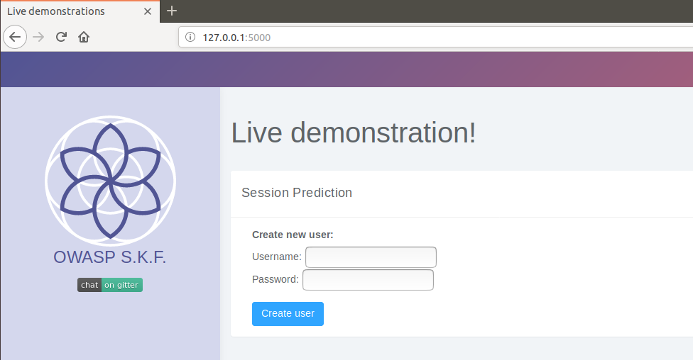
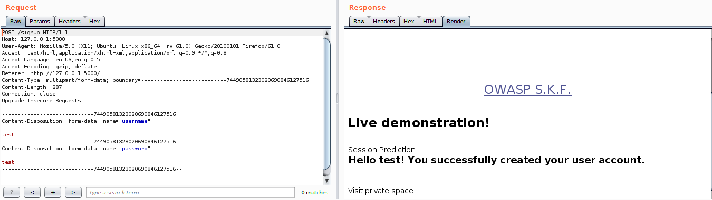
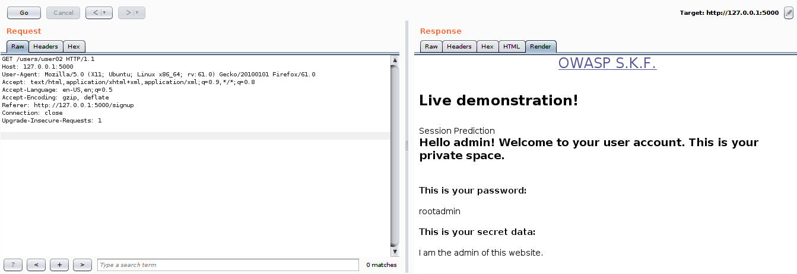

# KBID X - Session Prediction

## Running the app

```
$ sudo docker pull blabla1337/owasp-skf-lab:file-upload
```

```text
$ sudo docker run -ti -p 127.0.0.1:5000:5000 blabla1337/owasp-skf-lab:file-upload
```
Or simply:
```text
$ python SP.py
```


 Now that the app is running let's go hacking!



Alberto Rafael Rodríguez Iglesias - www.telecolabs.com

## Reconnaissance

The session prediction attack focuses on predicting session ID values that permit an attacker to bypass the authentication schema of an application. By analyzing and understanding the session ID generation process, an attacker can predict a valid session ID value and get access to the application.

In the first step, the attacker needs to collect some valid session ID values that are used to identify authenticated users. Then, he must understand the structure of session ID, the information that is used to create it, and the encryption or hash algorithm used by application to protect it. Some bad implementations use sessions IDs composed by username or other predictable information, like timestamp or client IP address. In the worst case, this information is used in clear text or coded using some weak algorithm like base64 encoding.

In addition, the attacker can implement a brute force technique to generate and test different values of session ID until he successfully gets access to the application.




When start the application we can see that we have a "create new user" functionality and we will be redirected to out private user space. First let's try to create a new user to see how the application behaves.



If we inspect the request with an intercepting proxy we can see that the application is performing a POST request that results in a data mutation, storing our file on the server.


## Exploitation

Now lets try different possibilities for the userID.

Lets try with user02.



As you can see we got access to another user's account. This proves the weak mechanism of sessions management implemented.
Thanks to it, we can get all the user's private information. In this case this allow us to get admin credentials for the website.


The application uses different directories to store the stylesheets and images that are being used by the application. Lets see if we can use a path traversel injection to upload our files inside these folders.


And there it is our file was being uploaded successfully in the static/img folder of the application and because this is accessible by the application we can access our file.


Now try to explore other accounts like user01.


## Additional sources

https://www.owasp.org/index.php/Session_Prediction
